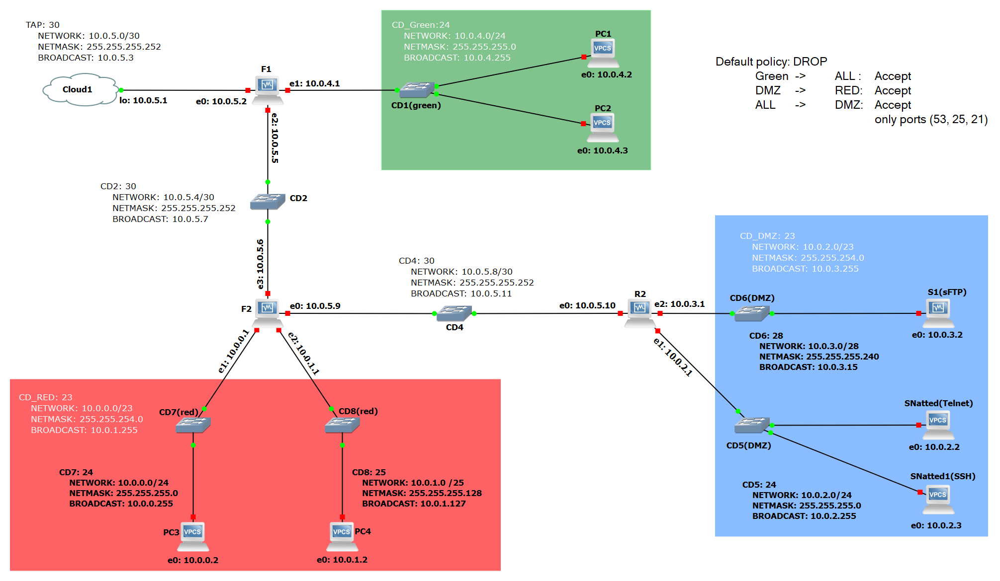
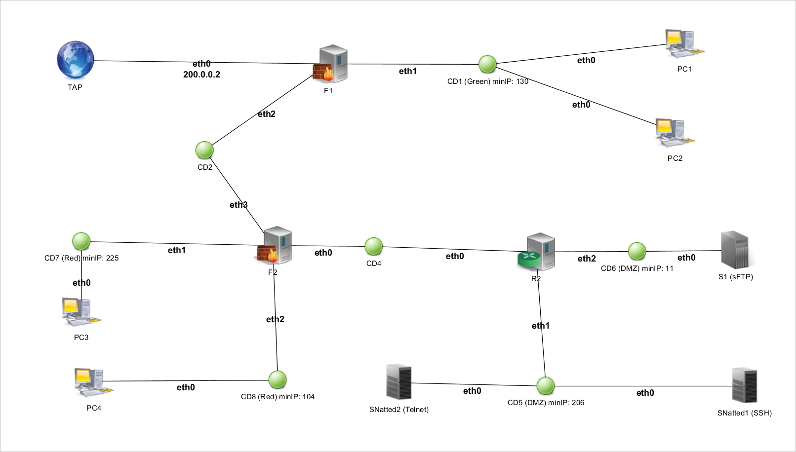

# Sor-project-29

Determinare per tutti i domini di collisione, laddove mancanti, i seguenti valori: 

## Configurazione domini di collisione
1. N = Subnet (Ad esempio, 172.16.0.0 / 12). 
2. BA = Broadcast Address (ad esempio, 172.31.255.255). 
3. UIP = Numero di IP utilizzabili. 
4. R = Intervallo degli indirizzi IP usabili (esempio, 172.16.0.0  ‐ 172.31.255.255)

## Tenere presente che: 
- I calcolatori rappresentano punti rete utente localizzati all'interno di un dato dominio di collisione; 
- Gli hub/switch (identificati con i pallini verdi) rappresentano i domini di collisione e sono etichettati con il nome 'CDn'  (dove n = 1, ...., ). 
- Per ogni dominio di collisione, devono essere determinati i valori di cui ai punti 1‐4 del precedente elenco; 
- I router (identificati con l'etichetta Rn (n = 1,...)) rappresentano le interconnessioni di livello 3 (L3) tra i domini di collisione; 
- I firewall (identificati con l'etichetta Fn (n = 1,...)) costituiscono i dispositivi di sicurezza presenti nel sistema. 

Ogni firewall si comporta anche da router (ovvero connette domini di collisione), e deve essere configurato per
soddisfare le specifiche elencate nella sezione Configurazione Firewall; 
- I server (identificati con l'etichetta Sn (n = 1,...)) rappresentano servizi offerti dalla rete e accessibili dall'esterno. Un server ha normalmente alcune porte di ascolto TCP/UDP attive che devono essere raggiungibili. La raggiungibilità di una porta deve essere ottenuta mediante una opportuna configurazione delle regole dei firewall. 
- I server contrassegnati dall'identificativo SNatted forniscono servizi soggetti a port forwarding da parte del firewall gerarchicamente superiore più vicino, che deve essere considerato operante come router NAT. Per questi server è necessario consentire l'erogazione del servizio mantenendo nascosta la reale macchina che lo fornisce evitando, nel contempo, che possa essere possibile accedervi direttamente. 

Ogni server è etichettato con i nomi simbolici dei servizi che devono essere erogati (esempio, https, imap, ecc.). Più domini di collisione adiacenti formano delle 'aree', che possono essere di tipo DMZ, GREEN e RED. 
## Configurazione Firewall
Limitazioni generali sul traffico di rete (in ordine crescente di priorità): 
- Policy di default per tutte le tipologie di area: DROP 
- Le Green Area possono aprire connessioni destinate a qualsiasi altro host; 
- Le aree DMZ possono aprire connessioni ma solo se destinate ad host interni ad aree RED; 
- Le aree DMZ devono garantire che i seguenti servizi siano accessibili da qualsiasi tipologia di host 
esterno all’area (ANCHE se non è esplicitamente presente il server corrispondente al suo interno):  
  - dns sulla porta 53   
  - smtp sulla porta 25  
  - ftp sulla porta 21  
- Per quanto riguarda ogni server S esplicitamente presente nella topologia: 1.
  - Se S compare in un’area GREEN, i suoi servizi non devono essere visibili all’esterno dell’area; 
  - Se S compare in un’area DMZ, i suoi servizi devono essere visibili da qualsiasi host; 
  - Se S compare in un’area RED, i suoi servizi devono essere visibili dalle aree DMZ; 

